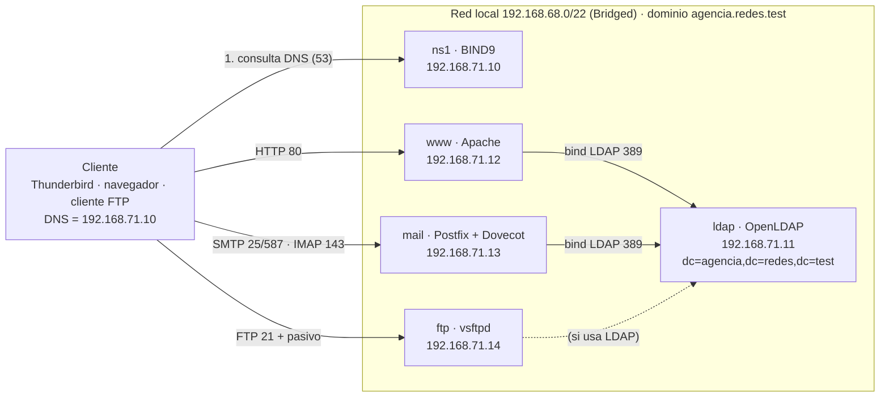

# Diagrama de red local (Entregable a) – BORRADOR

Todos consultan primero a BIND9
y OpenLDAP es la fuente de credenciales para Apache, Correo y FTP.

Pendiente: confirmar IPs, que todos estén en esta misma red Wi-Fi y puertos finales con cada responsable.
